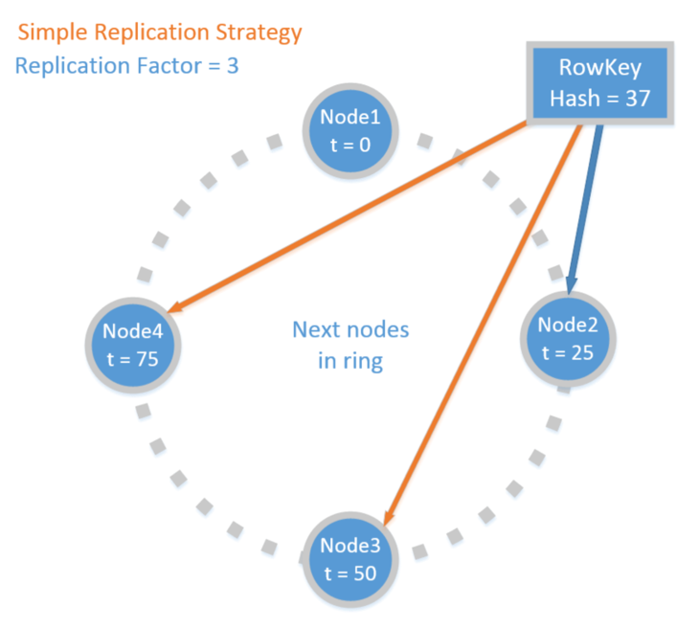
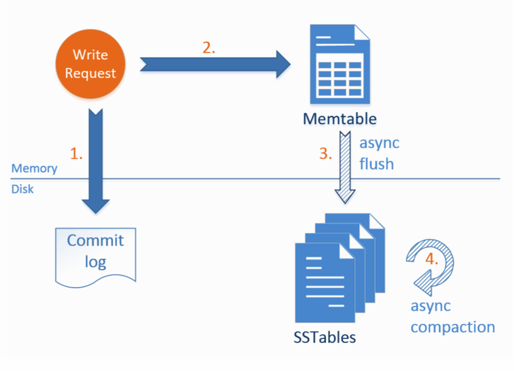

# Running Cassandra with Docker

This is a step-by-step guide for running a Cassandra cluster with Docker.

## Goal - Experiment with Cassandra
The goal is to have an automated way for creating, customizing, destroying and recreating a Cassandra cluster, so that we can experiment with adding/removing nodes, changing consistency levels, etc.


In order to achieve this goal, normally we would need to:
* provision 3 Linux machines
* install Cassandra on each
* configure Cassandra on each node, so that they are aware of each other.

Let's see how is this different with the help of Docker.

## Docker and its benefits (for us)

Docker is a lightweight virtualization framework.


From our point of view, docker has two huge benefits, that make it very suitable for trying out new technologies.

### Creating a container is incredibly quick
Creating a new container from an image usually takes less than a second. This speed advantage of docker is coming from various optimizations:
- Using the host OS' kernel instead of bootstrapping a new guest OS
- Copy-on-write support of the file system

### Docker has a rich public library of ready-to-use container images

The [docker hub](https://hub.docker.com) is a rich library of public images that are easy to use. These images can be referred by their name, just like they are in other package managers:
- DEB packages in Debian-based systems
- Maven dependencies in java
- NuGet packages in .NuGet
- NPM packages in node.js

## Demo #1 - Using the Official Cassandra Image

### Creating the first node
```bash
# docker run - creates a new container from an image
docker run --name node1 -d cassandra
```
- cassandra is the name of the image (it will be downloaded on the first use)
- the name of the container is node1 (can be anything)
- the option -d stands for "detached mode"

```bash
# connect to the virtual machine, by executing bash
# docker exec - executes a command in the container
# the option -it redirects the output to the current console (similar to ssh)
docker exec -it node1 bash
```
```bash
# test cluster formation
docker exec -it node1 nodetool status

# You will get an output similar to
Datacenter: datacenter1
=======================
Status=Up/Down
|/ State=Normal/Leaving/Joining/Moving
--  Address     Load       Tokens       Owns    Host ID                               Rack
UN  172.20.0.2  105 KB     256          ?       21f00824-b223-455d-99e3-98420d9efa73  rack1
```
The first two characters of each line specify the Status and the current state of the node:
- [U]p or [D]own
- [N]ormal, [L]eaving, [J]oining or [L]eaving

Now we have a fully functional Cassandra cluster with a single node. We could test it with the CQL shell:
```bash
docker exec -it node1 cqlsh
```

### Adding new nodes
```bash
## start the second node and link it to the first
docker run --name node2 -d --link node1:cassandra cassandra

## start the third node
docker run --name node3 -d --link node1:cassandra cassandra

## test cluster formation again
docker exec -it node1 nodetool status
```
Now we should have a functional Cassandra cluster with 3 nodes.

### Managing docker containers
```bash
## display active containers
docker ps

## display all containers
docker ps -a

## stop containers
docker stop node1 node2 node3

## remove containers
docker rm node1 node2 node3
```
### Dockerfile

A docker image is usually created from a script called and named Dockerfile.
Check the Official Cassandra 3.5 Dockerfile [by clicking here](https://github.com/docker-library/cassandra/blob/b1edfd288bc54c5eccbc19f8fd492b0bf518ed1b/3.5/Dockerfile).

### Summary

```bash
# create a new container from an image
docker run --name node1 -d cassandra

# create a new container from an image
# and link it to another container
docker run --name node2 -d --link node1:cassandra cassandra

# pull a remote image (optional)
docker pull cassandra
```
Artifact | What is it | Similar to
--- | --- | ---
cassandra | docker image | type (.class)
node1 | docker container | instance of class
Dockerfile | the script file of the docker image | type definition (.java)

## Demo #2 - Custom Image

It is recommended to treat images immutable, so that their usage is reproducible. If you feel that you need to copy a file to a container, or install some component in the container, that is a sign that you need a new image.

### Creating a custom image
```bash
vim image/Dockerfile
```
The custom image
- inherits from the official image
- copies some additional files
- installs additional components

### Build and publish a custom image
```bash
# build image
cd image
docker build -t medvekoma/cassandra-demo .

# push image to docker hub (requires authentication)
docker push medvekoma/cassandra-demo
```

## Demo #3 - Docker Compose
Even though creating and linking the cluster nodes was simple, this is still a manual process. If we want to automate the orchestration of more docker containers, docker-compose becomes handy:

```bash
cd compose
## view definition file
vim docker-compose.yml
```
```yml
version: '2'
services:

  node1:
    image: medvekoma/cassandra-demo
    ports:
      - "9042:9042"
      - "9160:9160"
    environment:
      CASSANDRA_CLUSTER_NAME: demo
      CASSANDRA_SEEDS: node1,node2,node3
    restart: unless-stopped

  node2:
    image: medvekoma/cassandra-demo
    environment:
      CASSANDRA_CLUSTER_NAME: demo
      CASSANDRA_SEEDS: node1,node2,node3
    restart: unless-stopped

  node3:
    image: medvekoma/cassandra-demo
    environment:
      CASSANDRA_CLUSTER_NAME: demo
      CASSANDRA_SEEDS: node1,node2,node3
    restart: unless-stopped
```

```bash
## create cluster
docker-console up -d
## test cluster formation
docker exec -it compose_node1_1 nodetool status
## scale up
docker-compose scale node3=2
## stop and remove cluster
docker-compose down
```
Now we really have a means to create a Cassandra cluster in seconds and dispose it when we don't need it anymore.

## Cassandra Demo #1 - Consistency and Availability
Overview of Cassandra Partitioning and Replication

Rows are distributed among nodes based on the hash value of their row key.

Depending on the replication strategy and replication factor, the data is distributed to other nodes.
```bash
# start the Cassandra CQL shell on a node
docker exec -it compose_node1_1 cqlsh
```
### Setup database
```bash
# connect to one of the nodes
docker exec -it compose_node1_1 bash
# execute setup script
cqlsh -f /demo/setup.cqlsh
# review setup script
vim /demo/setup.cqlsh
```
### Test database
```sql
USE nobel;
SELECT * FROM nobel_laureates WHERE year = 2002;
SELECT * FROM nobel_laureates WHERE borncountrycode = 'HU';
```
```bash
# check which nodes hold the data
nodetool getendpoints nobel nobel_laureates 1986
nodetool getendpoints nobel nobel_laureates 1987
...
```

### Failover tests
#### a) Let's stop a node
```bash
docker stop compose_node2_1
```
```sql
-- Is it still operational?
SELECT * FROM nobel_laureates WHERE year = 2002;
SELECT * FROM nobel_laureates WHERE year = 2001;
```
#### b) Let's require two nodes to answer
```sql
cqlsh> CONSISTENCY TWO;
```
How about now? Is it operational?

#### c) Let's remove the stopped node
```bash
nodetool status
nodetool removenode <hash>
```
How about now?
```sql
-- Is it operational?
SELECT * FROM nobel_laureates WHERE year = 2002;
SELECT * FROM nobel_laureates WHERE year = 2001;
```
## Cassandra Demo #2 - Write Path
This demo explains the steps taken by Cassandra when storing information on a single node.


### Create test table
```sql
CREATE KEYSPACE demo WITH replication = {'class': 'SimpleStrategy', 'replication_factor': 1};
USE demo;
CREATE TABLE meetup
(
  id int PRIMARY KEY,
  presenter text,
  topic text,
  date timestamp
);
INSERT INTO meetup (id, presenter, topic) VALUES ( 1, 'Ada Lovelace', 'Storing the Internet on a Raspberry Pi');
SELECT * FROM meetup;
```
### Check the data files on the node (sstable)
```bash
# list the ip addresses of the nodes
for i in {1..3}; do docker exec -it compose_node${i}_1 hostname -I; done

# check which node holds the data
docker exec -it compose_node1_1 nodetool getendpoints demo meetup 1

# go to that machine
docker exec -it compose_node2_1 bash

# folder for the sstables
cd /var/lib/cassandra/data/demo/meetup-<GUID>/
ls -la
# no data files yet

# flush the memtable to disk
nodetool flush

# check the content of the sstable
java -jar /demo/sstable-tools.jar toJson ma-1-big-Data.db
```

```sql
# enter CQL shell to modify the data
cqlsh
-- update some columns
UPDATE demo.meetup
SET date = '2016-06-16', presenter = 'Charles Babbage'
WHERE id = 1;
-- verify results
SELECT * FROM demo.meetup;
```

```bash
ls -la
java -jar /demo/sstable-tools.jar toJson ma-1-big-Data.db
# no new data files - new data is still in memory

# flush data to disk
nodetool flush

# check sstable content again
ls -la
java -jar /demo/sstable-tools.jar toJson ma-1-big-Data.db
java -jar /demo/sstable-tools.jar toJson ma-2-big-Data.db

# compact data files
nodetool compact

# check sstable content again
ls -la
java -jar /demo/sstable-tools.jar toJson ma-3-big-Data.db
```
