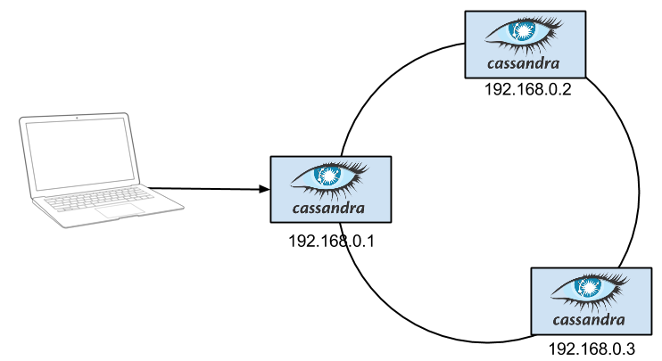

# Running Cassandra with Docker

This is a step-by-step guide for running a Cassandra cluster with Docker.

## Goal
The goal is to have an automated way for creating, customizing, destroying and recreating a Cassandra cluster, so that we can experiment with adding/removing nodes, changing consistency levels, etc.


Normally for each node we should
* provision a Linux machine
* install Cassandra on each
* configure Cassandra so that the nodes are aware of each other.

## Docker and its benefits (for us)

Docker is a lightweight virtualization framework.


From our point of view, docker has two huge benefits:

1. Creating a container is incredibly quick.
1. Docker has a rich public library of ready-to-use container images.

These two properties make docker very suitable for trying out new technologies. Creating a new container from an image usually takes less than a second. This speed advantage of docker is coming from various optimizations:
- Using the host OS' kernel
- Copy-on-write support of the file system

The [docker hub](https://hub.docker.com) is a rich library of public images very similar to
- DEB packages in Debian-based systems
- Maven dependencies in java
- NuGet packages in .NuGet
- NPM packages in node.js

## Demo #1 - Using the Official Cassandra Image

```bash
## start the first node
## docker run - creates a new container from an image
docker run --name node1 -d cassandra
```
- cassandra is the name of the image (it will be downloaded on the first use)
- the name of the container is node1
- the option -d stands for "detached mode"

```bash
## test cluster formation
## docker exec - executes a command in the container
## the option redirects the output to the current console (similar to ssh)
docker exec -it node1 nodetool status
```
You will get an output similar to
```
Datacenter: datacenter1
=======================
Status=Up/Down
|/ State=Normal/Leaving/Joining/Moving
--  Address     Load       Tokens       Owns    Host ID                               Rack
UN  172.20.0.2  105 KB     256          ?       21f00824-b223-455d-99e3-98420d9efa73  rack1
```
The first two characters of each line specify the Status and the current state of the node:
- [U]p or [D]own
- [N]ormal, [L]eaving, [J]oining or [L]eaving


```bash
## start the second node and link it to the first
docker run --name node2 -d --link node1:cassandra cassandra

## start the third node
docker run --name node3 -d --link node1:cassandra cassandra

## test cluster formation again
docker exec -it node1 nodetool status
```
Now we should have a functional Cassandra cluster.
```bash
## display active containers
docker ps

## display all containers
docker ps -a

## stop containers
docker stop node1 node2 node3

## remove containers
docker rm node1 node2 node3
```
## Dockerfile

Check the [Official Cassandra 3.5 Dockerfile](https://github.com/docker-library/cassandra/blob/b1edfd288bc54c5eccbc19f8fd492b0bf518ed1b/3.5/Dockerfile).

Artifact | What is it | Similar to
--- | --- | ---
cassandra | docker image | type (.class)
node1 | docker container | instance of class
Dockerfile | a dockerfile | type definition (.java)

## Demo #2 - Custom image

```bash
cd image
vim Dockerfile
```
The custom image
- inherits from the official image
- copies some additional files
- installs additional components

```bash
## build image
docker build -t medvekoma/cassandra-demo .
## push image to docker hub (requires authentication)
docker push medvekoma/cassandra-demo
```

## Demo #3 - Docker compose

```bash
cd compose
## view definition file
vim docker-compose.yml
## create cluster
docker-console up
## test cluster formation
docker exec -it compose_node1_1 nodetool status
## scale up
docker-compose scale node3=2
## stop and remove cluster
docker-compose down
```
## Cassandra Demo #1 - consistency
Overview of Cassandra Partitioning and Replication

Rows are distributed among nodes based on the hash value of their row key.

Depending on the replication strategy and replication factor, the data is distributed to other nodes.
```bash
# start the Cassandra CQL shell on a node
docker exec -it compose_node1_1 cqlsh
```
### a) Setup database
```bash
# connect to one of the nodes
docker exec -it compose_node1_1 bash
# execute setup script
cqlsh -f /demo/setup.cqlsh
# review setup script
vim /demo/setup.cqlsh
```
Test database
```sql
USE nobel;
SELECT * FROM nobel_laureates WHERE year = 2002;
SELECT * FROM nobel_laureates WHERE borncountrycode = 'HU';
```

### b) Failover tests
```bash
# check which node holds the data
nodetool getendpoints nobel nobel_laureates 1986
nodetool getendpoints nobel nobel_laureates 1987
...
```
Let's stop a node
```bash
docker stop compose_node2_1
```
```sql
-- Is it still operational?
SELECT * FROM nobel_laureates WHERE year = 2002;
SELECT * FROM nobel_laureates WHERE year = 2001;

-- Let's require two nodes to answer
CONSISTENCY TWO;
-- and now? Is it operational?
```
Let's remove the stopped node
```bash
nodetool status
nodetool removenode <hash>
```
How about now?
```sql
-- Is it still operational?
SELECT * FROM nobel_laureates WHERE year = 2002;
SELECT * FROM nobel_laureates WHERE year = 2001;
```
